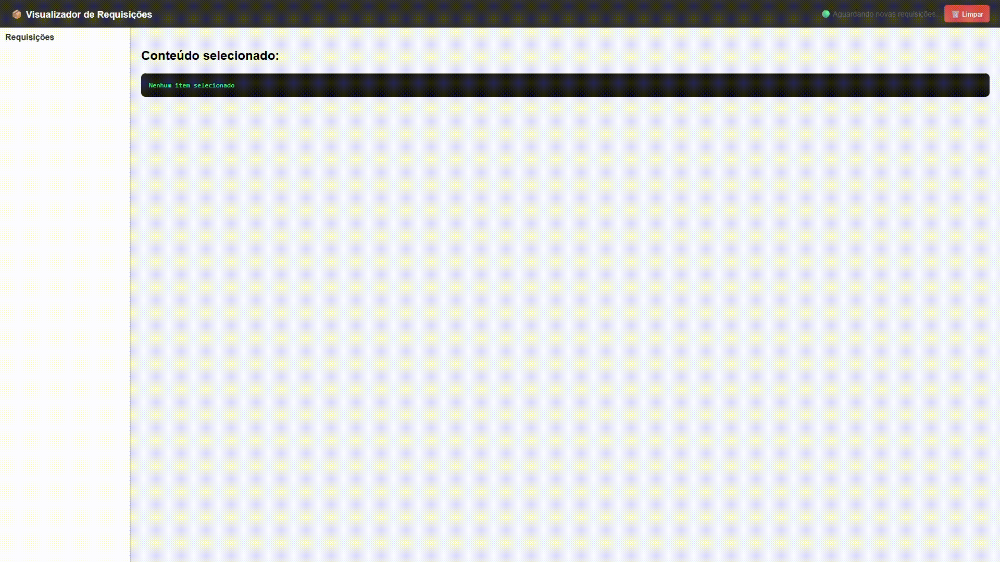

⚡ fastWebhook
Serviço leve para visualizar requisições Webhook em tempo real

Ferramenta simples e prática para testes de integração, especialmente útil durante implementações de webhooks no Zendesk ou outras plataformas de automação.

🚀 Funcionalidades

Visualização instantânea das requisições recebidas (JSON formatado).

Atualização em tempo real via Server-Sent Events (SSE) — sem recarregar a página.

Interface limpa e responsiva, com lista lateral e conteúdo detalhado.

Botão para limpar as requisições recebidas.

Endpoint de status para verificação de saúde do serviço.

🛠️ Instalação
git clone https://github.com/seuusuario/fastWebhook.git
cd fastWebhook
npm install

💡 O projeto usa apenas o Fastify — leve, rápido e sem dependências extras.

▶️ Execução
node server.js

O servidor será iniciado em:

http://localhost:3001

🌐 Endpoints
Método	Caminho	Descrição
POST	/	Recebe e armazena o corpo da requisição (ex: payload do webhook).
GET	/	Retorna todas as requisições armazenadas em formato JSON.
GET	/visualizar	Interface visual para explorar as requisições.
DELETE	/limpar	Remove todas as requisições da memória.
GET	/status	Retorna { status: "ok" } para monitoramento.
GET	/stream	Endpoint interno usado pela página para atualização em tempo real.
💻 Exemplo de uso (via cURL)

Envie uma requisição POST com JSON:

curl -X POST http://localhost:3001/ \
     -H "Content-Type: application/json" \
     -d '{"mensagem": "teste webhook"}'

Acesse o painel em:

👉 http://localhost:3001/visualizar

E veja o item aparecer automaticamente na lista lateral.

🧩 Caso de uso com Zendesk

Ideal para testar:

Webhooks configurados em Triggers e Automations do Zendesk.

Eventos de SunCo / Sunshine Conversations.

Integrações com Botpress, Power Automate ou outros serviços que disparam POSTs JSON.

⚙️ Tecnologias

Node.js (ES Modules)

Fastify

HTML/CSS Vanilla

Server-Sent Events (SSE) para atualização em tempo real

🧹 Limitações

Os dados são armazenados em memória, e se perdem ao reiniciar o servidor.

Projeto voltado para testes locais e de desenvolvimento.

📄 Licença

Distribuído sob a licença MIT.
Sinta-se à vontade para modificar e adaptar conforme suas necessidades.

✉️ Desenvolvido por Luiz Felipe — Consultor Zendesk & Engenheiro de Soluções CX

